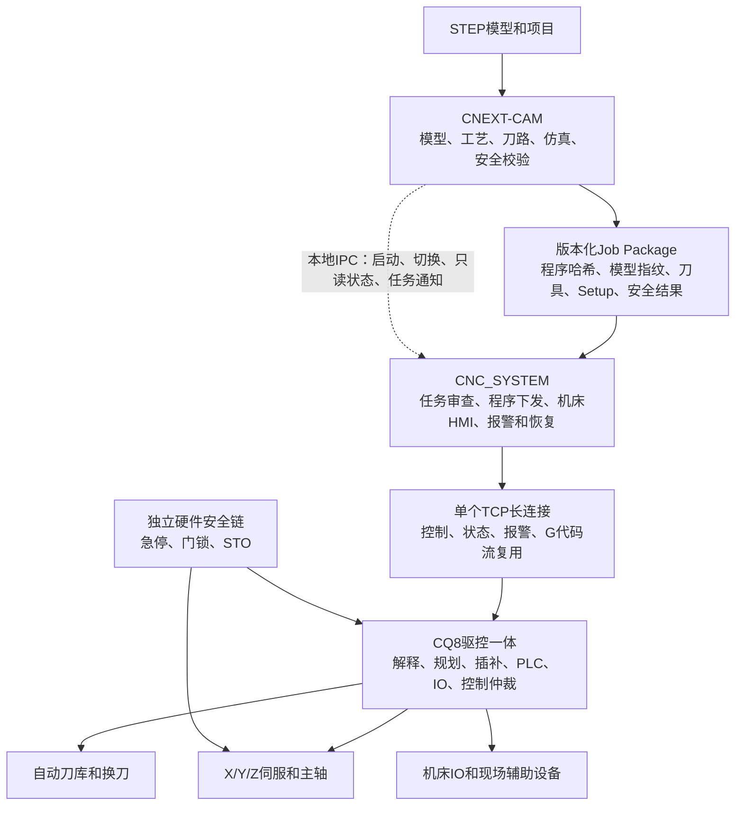

# PC-CQ8 整套系统总体技术方案

> **已被架构更正取代：** 本文中的 CNEXT-CAM/CNC_SYSTEM 双软件方案不再有效。当前唯一实现基线见《独立PC软件-CQ8架构基线》：只使用 `D:\yanggao\gcodecnc\untitled`，不引入 CNC_SYSTEM。本文保留为决策过程记录，在完成整体重写前不得作为开发依据。

## 1. 文档信息

| 项目 | 内容 |
|---|---|
| 文档名称 | PC-CQ8 整套系统总体技术方案 |
| 文档状态 | 总体方案基线草案 v1.0 |
| 编制日期 | 2026-08-04 |
| 产品组成 | Windows x64 PC + CNEXT-CAM + CNC_SYSTEM + 自研 CQ8 驱控一体系统 + 机床本体 |
| 首期机床范围 | X/Y/Z 三轴加工中心、一个主轴、自动刀库和自动换刀 |
| 最终验收模型 | `WH250852-模板紅色面加工（零件3）.STEP` |
| 文档用途 | 内部研发基线、甲方技术核对、接口冻结、现场联调和分阶段验收 |

本文档汇总截至 2026-08-04 已确认的总体决策。文中状态分为：

- **已确认**：作为当前产品和开发基线；
- **待专项定义**：方向已确定，字段、参数或状态机仍需形成分项规范；
- **现场确认**：必须依据实际机床、电气、刀库和 IO 决定；
- **用户后续补充**：暂不由研发团队自行假设。

## 2. 产品目标

本系统面向同时承担机床操作、工艺设计和数控编程的现场操作员，使其能够在同一台 PC 上完成：

1. 导入 STEP 模型；
2. 定义正面、Setup、毛坯和 G54；
3. 识别并人工选择孔、槽、平面和轮廓；
4. 选择工艺、刀具、顺序和加工参数；
5. 生成、仿真和安全校验 CQ8 目标 G 代码；
6. 把已验证任务提交到在线控制软件；
7. 检查机床、刀具、坐标、安全链和程序状态；
8. 将小程序整包下载或将大程序持续流式下发到 CQ8；
9. 通过 CQ8 完成实时插补、机床控制和安全联锁；
10. 对加工任务、程序版本、报警和操作过程进行追溯。

系统不追求无人参与的完全自动化。特征识别和工艺参数可以推荐，但 Setup、加工特征、工艺方案、刀具、参数、任务提交和机床启动均保留明确的人工确认。

## 3. 总体架构



### 3.1 已确认拓扑

- 一台 Windows x64 PC；
- 一套自研 CQ8 驱控一体系统；
- PC 与 CQ8 通过有线以太网连接；
- 同一台 PC 运行 `CNEXT-CAM` 和 `CNC_SYSTEM` 两个独立进程；
- 不采用 RK3568；
- `CNC_SYSTEM` 是唯一能够建立 CQ8 控制连接的 PC 进程；
- `CNEXT-CAM` 不直接控制机床；
- CQ8 独立承担实时运动，不依赖 Windows 或以太网提供实时确定性。

## 4. 生产软件平台

### 4.1 已确认

- 正式平台：Windows x64；
- CNEXT-CAM 和 CNC_SYSTEM 统一使用 64 位 Qt 生产工具链；
- OpenCascade、图形、网络、数据库和其他运行库全部统一为 64 位；
- 当前 CNC_SYSTEM 的 Windows/MinGW 32 位 Debug 版本只用于临时调试；
- 不再把 ARM/RK3568 交叉编译和部署包作为首期交付要求。

### 4.2 待专项定义

- Windows 具体版本和授权方式；
- 工业 PC 的 CPU、内存、GPU、硬盘、网卡和环境等级；
- 安装包、驱动、运行库和一键部署方式；
- 软件升级、回滚、配置备份和恢复；
- 开机自启动、异常拉起和系统账户策略；
- 最终显示器尺寸、分辨率、触摸和实体面板规格。

界面暂不绑定固定分辨率。现有 CNC_SYSTEM 中 1024x768 固定窗口与约 1944x1080 UI 设计的冲突必须在正式界面改造中消除。

## 5. 软件与控制器责任边界

| 能力 | CNEXT-CAM | CNC_SYSTEM | CQ8 | 独立安全硬件 |
|---|---|---|---|---|
| STEP和项目 | 主责 | 查看任务摘要 | 不负责 | 不负责 |
| Setup和特征选择 | 主责、人工确认 | 校验任务摘要 | 接收执行数据 | 不负责 |
| 工艺、刀具和参数 | 推荐并由人确认 | 与机床实际数据复核 | 执行确认值 | 不负责 |
| 刀路与G代码生成 | 主责 | 不重新生成 | 不生成 | 不负责 |
| 最终代码仿真和安全校验 | 主责 | 二次能力和机床准备检查 | 执行前语法/能力检查 | 不负责 |
| Job Package | 生成并冻结 | 校验、审查和接收 | 不直接读取文件 | 不负责 |
| CQ8通信 | 无控制连接 | 唯一PC通信主体 | TCP服务端 | 不负责 |
| G代码解释和轨迹规划 | 离线预览 | 展示状态 | 主责 | 不负责 |
| 实时插补和伺服控制 | 不负责 | 不负责 | 主责 | 最终动力切断 |
| PLC和IO状态机 | 配置需求 | 状态与维护界面 | 主责 | 安全输入输出 |
| 运行控制 | 无权限 | 提交请求 | 最终仲裁 | 急停/STO最高优先级 |
| 报警与恢复 | 显示只读摘要 | 权威PC界面和日志 | 产生状态、认可恢复点 | 保持安全状态 |

## 6. 双进程一体化体验

### 6.1 进程边界

`CNEXT-CAM` 与 `CNC_SYSTEM` 面向同一个现场用户，视觉、术语和任务状态应统一，但故障、升级和控制权相互隔离。

- CNEXT-CAM 崩溃不能影响 CQ8 当前运行；
- CNC_SYSTEM 保持 CQ8 唯一控制会话；
- 本地 IPC 只负责启动、界面切换、只读状态摘要和新任务通知；
- 最终加工内容不通过临时内存消息直接交接；
- Job Package 文件是两个进程之间唯一可信任务载体。

### 6.2 加工期间设计下一任务

已确认允许机床加工当前任务时，在同一 PC 上使用 CNEXT-CAM 设计下一任务：

- 当前运行任务、程序哈希和控制参数保持不可变；
- 下一任务使用独立 TaskId、项目版本和程序快照；
- 新任务只能进入 CNC_SYSTEM 的待接收队列；
- 新任务不能自动下载、装载或替换当前程序；
- CAM 只读取必要的机床运行、保持、报警和安全状态；
- CAM 的三维和仿真计算必须限制资源占用，不能影响 CNC_SYSTEM 响应；
- 高等级安全或设备报警强制将 CNC_SYSTEM 切到前台。

## 7. 从模型到机床的任务闭环

```mermaid
flowchart LR
    A["模型导入"] --> B["Setup/毛坯/G54确认"]
    B --> C["特征识别与人工选择"]
    C --> D["工艺/刀具/参数人工确认"]
    D --> E["刀路与CQ8 G代码"]
    E --> F["最终代码仿真和安全校验"]
    F --> G["生成Job Package"]
    G --> H["CNC_SYSTEM校验与人工接收"]
    H --> I["机床准备检查"]
    I --> J["整包下载或流式下发"]
    J --> K["CQ8执行前检查"]
    K --> L["实体面板最终启动"]
    L --> M["加工、报警、保持和恢复"]
    M --> N["完成记录与追溯"]
```



任一关键内容改变后，原有下游确认必须失效。例如模型、Setup、刀具、参数、G 代码、安全模板或机床配置变化时，不得继续使用旧程序哈希和旧机床侧确认。

## 8. Job Package

### 8.1 已确认原则

- 版本化文件交接；
- CNEXT-CAM 和 CNC_SYSTEM 两端人工确认；
- IPC 只通知，不替代文件；
- 文件不可被静默覆盖；
- 内容变化生成新版本；
- CNC_SYSTEM 校验成功后才能进入 CQ8 任务创建。

### 8.2 最低内容

- 包格式版本、TaskId、创建时间和软件版本；
- STEP 来源指纹、项目版本和模型标识；
- Setup、加工方向、毛坯和 G54；
- 人工确认的特征、工序和顺序；
- 刀具、刀柄、补偿号和最终参数；
- CQ8 目标 G 代码；
- 程序行数、字节数、哈希和预计下发模式；
- 安全规则版本、校验结果和阻断项；
- 仿真摘要及程序行-工序-模型特征映射；
- 包清单及整体哈希。

### 8.3 待专项定义

- 容器格式和字段 Schema；
- 数字签名或消息认证方式；
- 存储目录、命名和保留周期；
- 旧格式迁移和兼容期限；
- 删除、归档和审计权限。

## 9. PC-CQ8通信方案

### 9.1 已确认

- 有线以太网；
- CQ8 作为 TCP 服务端；
- CNC_SYSTEM 作为 TCP 客户端主动连接；
- 第一阶段使用一个 TCP 长连接；
- 控制、状态、报警和 G 代码分块通过 MessageType 复用；
- 报警、控制响应、心跳和缓冲临界状态优先于 G 代码数据；
- CQ8 实时插补不依赖网络周期。

### 9.2 单连接发送优先级

1. 协议错误、安全状态和连接关闭；
2. 控制响应、报警和运行状态变化；
3. 心跳及缓冲低水位/临界水位；
4. 周期状态；
5. G 代码分块和普通诊断日志。

### 9.3 报文基础

应用层报文至少具有：协议版本、消息类型、负载长度、会话 ID、绝对递增序号、请求关联号、CRC 和负载。

TCP 保证字节有序，但不能替代业务确认。PROGRAM_CHUNK_ACK 表示 CQ8 已校验并接纳程序分块，而不只是网络字节已经到达。

### 9.4 暂不确认

- IP 地址、端口和控制网段；
- 字节序、结构对齐和最大报文长度；
- 心跳、超时、窗口和重发具体数值；
- 身份认证、加密和消息签名；
- 状态上报周期和坐标精度。

这些参数不阻塞总体架构，但必须在双方编码联调前冻结。

## 10. 大程序与旋转缓冲区

### 10.1 下发模式

| 模式 | 条件 | 行为 |
|---|---|---|
| 整包下载 | 程序能够完整存入 CQ8 且满足阈值 | 完整接收、整体校验后启动 |
| 预下载流式执行 | 大程序、复杂程序或 CQ8 存储不足 | 先达到安全水位，再启动并持续下发 |
| 仅下载不执行 | 调试、审查或预装载 | 保持待确认，不自动运行 |

10000 行是产品层的初始流式触发条件之一，不是底层唯一标准。最终还需考虑程序字节数、CQ8 可用内存、短线段密度、循环展开规模和预计执行时间。

### 10.2 CQ8两级缓冲

1. **G代码接收环形缓冲区**：保存已收到但尚未解释的程序块；
2. **轨迹规划缓冲区**：保存已经解释和规划、等待实时插补的轨迹。

两个缓冲区不能混用。轨迹即将耗尽时，CQ8 必须提前受控减速进入保持，不能等运动数据完全耗尽后突然停轴。

### 10.3 待专项定义

- 两级缓冲容量；
- 高、正常、低和临界水位；
- 启动前最低轨迹时间，建议通过台架测试在 10-30 秒范围内冻结；
- 单个 PROGRAM_CHUNK 大小；
- 最坏短线段解析和规划能力；
- 指针回绕、幂等重发和断点续传策略。

## 11. CQ8 G代码基线

### 11.1 已确认

- CQ8 使用自主定义、版本化的 G 代码方言；
- 语法兼容常见 ISO/Fanuc 使用习惯，但不声明完全兼容；
- CNEXT-CAM 以 CQ8 为主后处理目标；
- Siemens 和 Fanuc 仅保留可选兼容或回归用途；
- 首期只支持毫米 `G21`，明确拒绝 `G20`；
- 首期只生成绝对编程 `G90`，禁用 `G91`；
- 支持 `G00/G01/G02/G03`；
- 支持 `G17/G18/G19` 的解释器能力，首期主要加工平面为 `G17`；
- 支持 `G40/G41/G42` 和 `G43/G49`，补偿必须满足安全引入/引出；
- 支持 `G54-G59`，首期 CAM 默认一个已确认 G54；
- 支持 `G80-G85` 能力范围，循环参数仍需细化；
- 支持 `T/M06`、主轴和现场映射的辅助 M 代码；
- 支持函数化子程序方向，重复逻辑可使用 `M98/M99`；
- 未知、非法或能力不匹配指令必须拒绝，不能静默忽略。

### 11.2 圆弧规则

- CQ8 接受 I/J/K 和 R 两种输入；
- CNEXT-CAM 统一生成 I/J/K；
- I/J/K 为相对圆弧起点的圆心偏移；
- 整圆只允许 I/J/K；
- `R > 0` 为小于或等于 180° 圆弧；
- `R < 0` 为大于 180° 圆弧；
- 同一程序块不能同时提供 I/J/K 和 R；
- 圆弧几何超过容差时拒绝执行。

### 11.3 安全起始与结束

推荐安全起始语义至少包括：

```gcode
G17 G40 G49 G80
G90 G94
G54
```

程序结束至少包括安全退刀、`M05`、冷却关闭和 `M30`。具体程序头尾、G80 等复位代码和现场 M 代码通过受控 Machine Profile 模板配置。

### 11.4 用户后续补充

- 程序号格式和范围；
- N 行号用途和规则；
- 注释符号、编码和长度；
- `%` 包围符；
- H/D 补偿号映射；
- 固定循环详细参数；
- 子程序参数、命名和嵌套上限；
- 数值精度与舍入规则。

流式传输绝对序号和 TaskId/ProgramHash 不依赖上述文本格式。

## 12. 控制权和操作面板

### 12.1 已确认

- CQ8 统一仲裁实体面板、内部状态机和 PC 请求；
- 手轮、点动和回零直接进入 CQ8，不经 Windows 转发；
- PC 控制命令都是请求，CQ8 判断是否接受；
- 实体面板停止和进给保持高于 PC 请求；
- PC 不能覆盖本地保持、限位、报警或安全联锁；
- 急停不使用普通 TCP 命令。

### 12.2 控制优先级

1. 独立硬件安全链和急停；
2. 实体面板停止和进给保持；
3. CQ8 内部限位、报警和状态机；
4. 实体面板启动、点动、手轮和回零；
5. CNC_SYSTEM TCP 控制请求；
6. 普通状态查询和程序传输。

## 13. 安全方案

### 13.1 已确认架构

- 急停采用独立双通道硬件回路；
- 防护门接入安全继电器或安全控制器；
- 安全输出直接控制伺服和主轴 STO；
- CQ8 接收安全状态，用于运行联锁、报警和状态机；
- PC 和 CQ8 普通软件均不得旁路安全链；
- 断电恢复后禁止自动重新启动运动。

### 13.2 分层责任

| 层级 | 安全职责 |
|---|---|
| CNEXT-CAM | 工艺、刀路、程序、坐标和参数的预防性检查 |
| CNC_SYSTEM | 机床准备预检查、状态呈现、控制请求和操作追溯 |
| CQ8 | 实时限位、PLC联锁、状态机、报警、受控保持和停止 |
| 硬件安全链 | 急停、门锁、STO等最终动力切断 |
| 机床机械 | 防护、机械限位、夹具强度和防甩出 |

### 13.3 待现场和安全评估

- 要求达到的安全等级和标准；
- 安全继电器/控制器型号；
- 双通道接线和诊断覆盖率；
- 安全复位、门锁和维护模式；
- 接触器反馈和制动控制；
- 第三方认证或验收要求。

## 14. 机床功能范围

### 14.1 首期已确认

- X、Y、Z 三个直线进给轴；
- 一个主轴；
- 三轴联动加工；
- 自动刀库和自动换刀；
- T 选刀和 M06 换刀；
- 刀号、目标刀和刀套一致性；
- 换刀位置、主轴定向、动作检测、超时报警和中断恢复。

### 14.2 只做预留

- 第四轴和第五轴；
- 旋转轴插补；
- 多轴运动学；
- RTCP；
- 四五轴碰撞和后处理。

### 14.3 现场确认

冷却、吹气、润滑、气压、液压、主轴冷却、排屑器、状态灯、蜂鸣器、夹具、测头、自动门、机械手和上下料等辅助设备不在当前阶段固定，待现场硬件和 IO 点表明确后决定。

## 15. 机床配置包

### 15.1 已确认原则

软件保持通用，不通过修改源码适配普通现场差异。现场通过版本化机床配置包定义具体设备。

### 15.2 配置内容

- 包格式版本、机床 ID 和适用 CQ8 版本；
- 轴、方向、行程、回零、速度、加速度和编码器；
- 主轴类型、速度、定向和控制参数；
- 刀库类型、容量、坐标、时序和恢复；
- IO 名称、地址、常开/常闭、方向和权限；
- 辅助设备启用项和状态机；
- 报警、警告、联锁和安全状态映射；
- Machine Profile 和 G 代码执行约束；
- PLC 配置版本；
- 内容哈希、创建人和审批记录。

### 15.3 生效流程

1. 导入但不生效；
2. 格式、版本、机床 ID 和哈希校验；
3. 展示与当前配置的差异；
4. 维护人员人工确认；
5. 写入 CQ8 暂存区；
6. CQ8 校验并原子激活；
7. 读取确认生效版本；
8. 支持备份、历史和回滚。

容器、Schema、暂存/激活协议和 PLC 原子提交状态仍需专项设计。

## 16. 界面总体方案

### 16.1 参考来源

界面功能结构参考《加工中心控制系统用户使用手册 manual_zh_CN(1)》中的加工主页、状态栏、IO、诊断、日志、坐标、刀具、刀库、轴参数、CAM孔槽平面、模板、仿真和工序组织。

参考其成熟操作习惯，但不复制品牌视觉、控制器参数和高密度按钮排布。

### 16.2 一级入口

1. 加工；
2. 任务；
3. 工艺设计；
4. 刀具坐标；
5. 机床；
6. 诊断；
7. 系统。

### 16.3 CNC_SYSTEM重点

- 始终可见的 CQ8、安全链、模式、任务、刀具、主轴、进给和报警；
- 加工程序、当前执行块、坐标和轨迹；
- Job Package 接收和差异审查；
- 整包/流式发送、两级缓冲和执行进度；
- 刀具、G54 和机床准备检查；
- 自动换刀状态和恢复；
- IO、轴、主轴、协议、报警和安全链诊断；
- 机床配置包的导入、激活、备份和回滚。

### 16.4 CNEXT-CAM七步流程

1. 文件与模型；
2. Setup；
3. 特征；
4. 工艺；
5. 刀具；
6. 验证；
7. 提交。

### 16.5 报警抢占

- 急停、安全链、伺服、主轴和刀库等高等级报警强制 CNC_SYSTEM 到前台；
- 普通加工报警在 CAM 顶部持续显示；
- 一般警告不打断工艺设计；
- 切换到 CNC_SYSTEM 不自动复位或恢复运动。

### 16.6 待确认

- 屏幕尺寸和分辨率；
- 触摸和实体软键布局；
- 普通操作、工艺和维护的权限层级；
- 自动运行期间 CAM 常驻显示的具体状态；
- 甲方强制要求保持的操作习惯。

## 17. 异常与恢复原则

| 场景 | 处理原则 |
|---|---|
| CNEXT-CAM崩溃 | 不影响当前CQ8加工；重启后恢复项目，不改变活动任务 |
| CNC_SYSTEM崩溃/PC重启 | CQ8按本地缓冲和状态机受控处理；重连后先同步，不自动恢复运动 |
| TCP短暂中断 | 缓冲足够时继续，自动重连和补发 |
| 轨迹进入临界水位 | CQ8提前受控减速并进入HELD |
| CQ8重启 | 禁止PC默认从头发送或启动，必须核对任务和机床状态 |
| 程序哈希不一致 | 拒绝续传、恢复和执行 |
| 换刀中断 | 进入专用诊断和恢复状态机，不允许普通程序行续行 |
| 急停/安全链 | 硬件切断；原因清除和人工复位后重新建立运行条件 |
| 程序人工修改 | 生成新版本、重新校验和重新确认 |

恢复不能简单依赖“当前 G 代码行”。CQ8 必须生成安全恢复点，并保存任务、程序、刀具、坐标系、模态、固定循环、子程序调用栈和机床状态。

## 18. 数据、版本和追溯

需要统一管理：

- STEP 模型指纹；
- 项目版本；
- OperationId；
- Job Package 版本和哈希；
- ProgramId、程序版本和程序哈希；
- CQ8 G代码方言版本；
- Machine Profile 版本；
- 机床配置包和 PLC 版本；
- 刀具表和坐标系版本；
- 安全规则版本；
- 操作员、确认人、下载人和启动记录；
- 报警、保持、恢复和完成记录。

界面显示的“当前任务”必须对应实际 CQ8 生效任务，不能把候选任务、待接收任务或失败任务显示为已生效。

## 19. 首期验收范围

### 19.1 软件与模型

- STEP 导入和模型指纹；
- 单 Setup、三轴正面和一个 G54；
- 孔和槽稳定闭环；
- 最终模型需要的有限平面/轮廓；
- 人工工艺、刀具和参数确认；
- CQ8 G代码生成、函数化、最终代码仿真和安全阻断；
- Job Package 提交和接收。

### 19.2 通信与控制

- TCP连接、协商和状态同步；
- 整包下载和大程序流式下发；
- 分块CRC、幂等重发和环形缓冲回绕；
- 高/低/临界水位；
- CQ8 G代码解释和三轴轨迹；
- 自动刀库和换刀；
- 实体面板、控制仲裁和安全链状态。

### 19.3 五级验收

1. CNEXT-CAM 离线验收；
2. CNC_SYSTEM/CQ8 协议台架验收；
3. 电气、伺服、主轴、刀库和安全联调；
4. 整机空运行和异常恢复；
5. `WH250852` 最终模型试切和尺寸检测。

第一阶段是否在合同中包含 CQ8 实机试切，仍需与甲方形成书面里程碑。

## 20. 当前项目基础

### 20.1 CNEXT-CAM已有基础

- Qt/C++ 工程和 OpenCascade STEP 导入；
- Setup 正面确认；
- 孔、槽、平面和轮廓加工基础；
- 人工 Operation Proposal 确认；
- 工艺、刀具和参数校验；
- G代码、循环、MPF/SPF 和程序快照；
- 最终代码安全校验、执行预览和仿真；
- 工序、程序行和刀路追溯；
- 项目持久化、模型指纹和真实孔模型自动测试。

### 20.2 CNC_SYSTEM已有基础

- Qt Widgets HMI；
- 位置、程序、偏置、系统、图形、报警和帮助页面；
- NC文件、编辑、导入导出和程序预处理；
- 刀偏、刀库、坐标系和诊断；
- TCP、面板、报警数据库和操作日志基础。

### 20.3 现状风险

- 工作区尚未形成干净、可追溯的正式交付基线；
- CNC_SYSTEM 仍有遗留控制器术语、变量和通信实现需要迁移到 CQ8；
- CNC_SYSTEM 当前 Debug 是 32 位，而生产目标已确认为 Windows x64；
- 两个软件的统一 Job Package 和 IPC 尚未实现；
- CQ8 通信、G代码解释器、两级缓冲和能力协商仍需开发；
- 真实槽模型和最终验收模型的自动化闭环尚未全部完成；
- 现场机床、电气、刀库、IO和安全器件参数尚未提供。

## 21. 后续开发路线

### 阶段A：文档和接口冻结

- 冻结本总体方案；
- 完成 Job Package Schema；
- 完成机床配置包 Schema；
- 完成 PC-CQ8 报文二进制布局；
- 完成 CQ8 G代码能力表和错误码；
- 完成状态机、报警和恢复点规范。

### 阶段B：CNEXT-CAM验收闭环

- 真实槽 STEP 黄金识别、刀路和代码；
- CQ8 主后处理；
- 函数化子程序和循环展开预览；
- Job Package 生成；
- `WH250852` 人工特征确认和端到端验证。

### 阶段C：CNC_SYSTEM PC生产基线

- 统一 Windows x64 Qt 构建；
- 清理遗留控制器边界；
- Job Package 接收和任务工作台；
- 单TCP消息复用客户端；
- 整包/流式下发和缓冲状态；
- CQ8控制请求、报警、恢复和日志；
- 自适应界面和CNEXT-CAM一体化入口。

### 阶段D：CQ8核心能力

- TCP服务端和协议协商；
- G代码接收环形缓冲；
- G代码解析、模态和能力检查；
- 轨迹规划缓冲和实时插补；
- 三轴、主轴、刀库和控制仲裁；
- 暂停、受控停止和安全恢复点；
- 配置包暂存、校验和原子激活。

### 阶段E：台架和压力测试

- 1万、10万和100万行程序；
- 短线段、圆弧、循环和子程序；
- 延迟、断线、重发和环形回绕；
- PC/CNC_SYSTEM/CQ8异常重启；
- 缓冲低水位和受控保持；
- 换刀中断和恢复；
- 长时间连续运行。

### 阶段F：现场适配和验收

- 采集机床、电气、刀库、IO和安全资料；
- 生成机床配置包；
- 电气和运动方向检查；
- 回零、行程、主轴和换刀调试；
- 整机空运行；
- 最终模型试切；
- 甲方签字验收。

## 22. 当前待甲方/现场确认清单

### P0：影响合同和总体交付

1. 分阶段验收是否把CQ8实机试切放在第一合同阶段；
2. `WH250852` 具体加工特征、装夹、G54、毛坯和质量指标；
3. 最终机床轴、主轴、刀库、伺服和编码器型号；
4. 自动刀库形式、容量和机械时序；
5. 急停、门锁、STO的安全等级和验收标准；
6. 尺寸、位置、粗糙度、节拍和测量方法。

### P1：影响软件和CQ8接口

1. CQ8两级缓冲容量和性能；
2. Job Package和机床配置包Schema；
3. TCP报文布局、超时和状态周期；
4. G81-G85、G43 H、M98/M99等详细语义；
5. 程序号、N行号、注释和`%`规则；
6. 报警码、控制请求和安全恢复点状态机；
7. Windows工业PC硬件和部署规范。

### P2：现场确认

1. 辅助设备和IO；
2. 测头、对刀仪、自动门和上下料；
3. 屏幕、触摸和实体面板规格；
4. IP、端口和网络布线；
5. 安装、升级、备份和维护责任。

## 23. 配套技术文件

| 文件 | 当前状态 |
|---|---|
| 《整机控制系统技术确认清单》 | 已建立，持续更新 |
| 《PC-CQ8通信接口协议》 | v0.1草案 |
| 《CQ8 G代码能力表》 | v0.1草案 |
| 《加工中心手册对标与一体化界面总体方案》 | 已建立 |
| 《Job Package Schema》 | 待编写 |
| 《机床配置包 Schema》 | 待编写 |
| 《CQ8状态机与错误码》 | 待编写 |
| 《自动换刀状态机》 | 待现场刀库资料 |
| 《机床IO点表》 | 待现场资料 |
| 《安全回路与风险评估》 | 待电气/安全共同完成 |
| 《整机测试与验收大纲》 | 待总体方案确认后编写 |
| 《WH250852工艺确认单》 | 待最终模型人工确认 |

## 24. 总体确认记录

| 确认主题 | 状态 | 甲方/用户 | 研发 | 日期/附件 |
|---|---|---|---|---|
| PC + CQ8总体拓扑 | 已确认 |  |  |  |
| Windows x64生产平台 | 已确认 |  |  |  |
| CNEXT-CAM/CNC_SYSTEM双进程 | 已确认 |  |  |  |
| CNC_SYSTEM独占CQ8控制权 | 已确认 |  |  |  |
| TCP单连接与流式下发 | 已确认方向 |  |  |  |
| CQ8 G代码总体能力 | 已确认方向 |  |  |  |
| 独立硬件安全链 | 已确认架构 |  |  |  |
| 三轴、主轴和自动刀库 | 已确认范围 |  |  |  |
| 现场机床配置包 | 已确认方向 |  |  |  |
| 最终模型加工范围 | 待确认 |  |  |  |
| 分阶段验收和责任边界 | 待甲方确认 |  |  |  |
